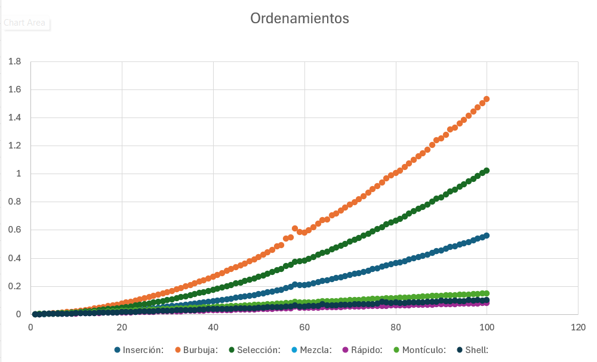

# Analisis de Algoritmos de Ordenamiento

Es un programa que corre diferentes algoritmos en diferentes condiciones, de las cuales recupera el tiempo de ejecución de estos. Los algoritmos utilizados son los siguientes:

- **Ordenamiento por Inserción**
- **Ordenamiento de Burbuja**
- **Ordenamiento por Selección**
- **Ordenamiento por Mezcla**
- **Ordenamiento Rápido**
- **Ordenamiento por Montículos**
- **Ordenamiento de Shell**

## Requisitos para ejecutar el programa
- **GCC** (GNU Compiler Collection)

## ¿Cómo instalar?
**Desde la terminal:**
1. Clone el repositorio (o bien descarge el documento algoritmos.cpp de este repositorio):
   ```sh
   git clone https://github.com/xPaolaLuna/Analisis-Algoritmos-Ordenamiento
   ```
2. Entre al directorio del proyecto (o bien, donde haya descargado el documento):
   ```sh
   cd algoritmos_de_ordenamiento
   ```
3. Compile el código:
   ```sh
   g++ algoritmos.cpp -o algoritmos -std=c++20
   ```
4. Ejecute el código
   ```sh
   ./algoritmos
   ```

## Explicación de algoritmos
Se creó este programa para calcular el tiempo de ejecución de algoritmos para comparar un arreglo de cierta longitud con números aleatorios con los de demás longitudes, que van aumentando de 10 en 10 (por defecto) cada vez que se ejecuten estos mismos un total de 1000 veces (por defecto).

  #### Vector que ordenaremos
Definiremos un arreglo con una cantidad estática de elementos, que a su vez se le asignarán de manera aleatoria. Los algoritmos de ordenamiento solo tendrán acceso a la cantidad de numeros aleatorios que se generaron en la iteración y a su vez la cantidad de estos se generarán a partir del valor mínimo y el incremento que se le asigne (por defecto 10 y 10, respectivamente).

  #### Acceso a los algoritmos
Tienen ubicación al final del archivo y en forma de funciones. Como argumentos tiene el vector a ordenar y la cantidad de elementos a ordenar.

  #### Guardado de tiempos
El tiempo pasado durante la ejecución de un algoritmo se guarda en un cronómetro activado previo a la ejecución de este y se para en cuanto acabe. Una vez se ejecute, el tiempo se pasa a una matriz que posteriormente utilizaremos para exportar los datos al archivo .csv. El promedio de las ejecuciones se guarda en la misma columna con la longitud y en la última fila.

   #### Exportado de los datos
Para exportar los datos se usó la librería de "fstream", la cual tiene una sintaxis parecida a la salida de datos a consola y fue sencilla de utilizar. Al archivo le dimos formato .csv.

## Explicación de algoritmos
### Inserción
El algoritmo de inserción es un método sencillo de ordenamiento que construye una lista ordenada agregando elementos en su ubicación correcta dentro de la parte ya organizada.

Funcionamiento

Se inicia con el segundo elemento, ya que el primero se considera ordenado.

Se compara el elemento actual con los anteriores.

Se desplazan los valores mayores para hacer espacio.

Se coloca el elemento en su posición correspondiente.

Se repite este proceso hasta ordenar toda la lista.

Complejidad

Mejor caso: O(n)

Peor caso: O(n²)

Caso promedio: O(n²)

### Burbuja
El método de ordenamiento burbuja opera comparando elementos adyacentes y realizando intercambios si están en el orden incorrecto. Este proceso se repite hasta que la lista queda ordenada.

Funcionamiento

Se recorren los elementos de la lista comparando pares consecutivos.

Si un valor es mayor que el siguiente, se intercambian.

Se repite el proceso hasta que no haya más cambios en un ciclo completo.

Complejidad

Mejor caso: O(n)

Peor caso: O(n²)

Caso promedio: O(n²)

### Selección
Este algoritmo divide la lista en dos partes: una ordenada y otra no ordenada. En cada iteración, busca el elemento más pequeño en la parte desordenada y lo intercambia con el primer valor no ordenado.

Funcionamiento

Se busca el menor elemento en la lista.

Se intercambia con el primer elemento no ordenado.

Se repite hasta ordenar toda la lista.

Complejidad

Mejor caso: O(n²)

Peor caso: O(n²)

Caso promedio: O(n²)

### Mezcla
Este algoritmo eficiente sigue el enfoque de "divide y vencerás". Separa la lista en dos mitades, ordena cada una recursivamente y luego las fusiona en una lista ordenada.

Funcionamiento

Si la lista tiene uno o ningún elemento, ya está ordenada.

Se divide en dos partes.

Se ordena cada mitad con recursión.

Se combinan ambas mitades ordenadas en una sola lista.

Complejidad

Mejor caso: O(n log n)

Peor caso: O(n log n)

Caso promedio: O(n log n)

### Rápido
Quick Sort es un método eficiente basado en "divide y vencerás". Selecciona un pivote, separa los elementos menores y mayores en dos sublistas y las ordena recursivamente.

Funcionamiento

Se elige un pivote.

Se reorganizan los valores colocando los menores a la izquierda y los mayores a la derecha.

Se aplica Quick Sort a ambas partes.

La lista queda ordenada cuando todas las sublistas están organizadas.

Complejidad

Mejor caso: O(n log n)

Peor caso: O(n²)

Caso promedio: O(n log n)

### Montículo
Este algoritmo usa una estructura de montículo (heap). Convierte la lista en un max-heap, extrae el mayor elemento y lo coloca en su posición final, repitiendo el proceso hasta que la lista esté ordenada.

Funcionamiento

Se construye un montículo máximo.

Se intercambia el primer elemento con el último y se reduce el tamaño del montículo.

Se reorganiza el montículo y se repite el proceso hasta ordenar la lista.

Complejidad

Mejor caso: O(n log n)

Peor caso: O(n log n)

Caso promedio: O(n log n)

### Shell
Shell Sort es una optimización del método de inserción. Permite intercambios a mayor distancia antes de ordenar elementos cercanos. Utiliza una secuencia de incrementos (gaps) para dividir la lista en grupos y ordenarlos, reduciendo progresivamente el gap hasta llegar a 1.

Funcionamiento

Se define una secuencia de gaps.

Para cada gap, se ordenan los elementos separados por esa distancia.

Se reduce el gap hasta que sea 1.

Se aplica una última inserción para finalizar el ordenamiento.

Complejidad

Mejor caso: O(n log n)

Peor caso: O(n²)

Caso promedio: Depende de la secuencia de gaps.

## Proyecto

-**`sorting_time.cpp`**: Archivo de código fuente donde se ejecutan todos los procesos. Contiene la función principal main y las implementaciones de los algoritmos de ordenamiento. En este archivo se genera el arreglo, se ejecutan los métodos de ordenamiento y se exportan los resultados obtenidos.

-**`README.md`**: Documento que incluye la descripción y detalles del proyecto.

-**`Archivos CSV`**: Ficheros que almacenan los tiempos de ejecución y los promedios correspondientes a arreglos de la misma longitud.

## Constantes globales

NUM_PRUEBAS: Número de pruebas que se realizarán para las longitudes de los vectores.

MIN_TAMANO: Tamaño mínimo del vector.

MAX_TAMANO: Tamaño máximo del vector.

INCREMENTO: Incremento en el la longitud del vector cada que pase una prueba.

## Resultados

El resultado que obtuvimos son los archivos con extensión .csv ubicados en la carpeta donde se guardó y ejectuó el proyecto. Estos datos se pueden observar de mejor manera en un editor de hojas de cálculo como lo es excel.

## Conclusiones
Concluímos que en promedio hay ciertos algoritmos mejores que otros, y según nuestros resultados, el orden en base a los mejores con grandes cantidades de datos son:
1.- Ordenamiento Rápido

2.- Ordenamiento por Mezcla

3.- Ordenamiento Shell

4.- Ordenamiento por Montículo

5.- Ordenamiento por Inserción

6.- Ordenamiento por Selección

7.- Ordenamiento por Burbuja



## Alumna

Luna Palafox Ana Paola
